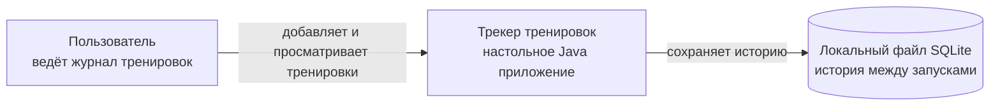

# Контекст приложения

```mermaid
flowchart LR
    User[Пользователь<br/>ведёт журнал тренировок]
    App[Трекер тренировок<br/>настольное Java приложение]
    Storage[(Локальный файл SQLite<br/>история между запусками)]

    User -->|добавляет и просматривает тренировки| App
    App -->|сохраняет историю| Storage
```

На P11 приложение хранит записи в локальном файле SQLite `data/workouts.db`. Отдельный сервер,
пароль администратора и подключение к сети не нужны.
